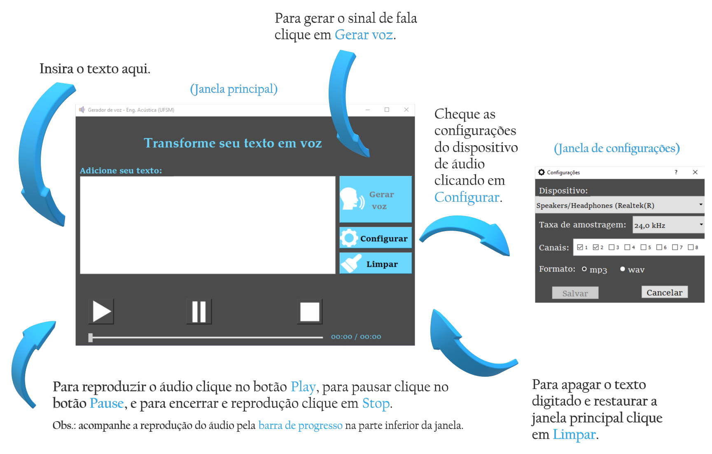

# speech-synthesizer
Aplicativo desenvolvido em Python para gerar (sintetizar) um sinal de fala a partir de um texto, desenvolvido por alunos do curso de graduação em [Engenharia Acústica][EAC], pela Universidade Federal de Santa Maria ([UFSM][ufsmsite]). 

## Artigo (FONO 2020)
Breve resumo do artigo apresentado no [XXVIII Congresso Brasileiro de Fonoaudiologia][SITE_FONO2020].

- **Introdução**: Sistemas computacionais de síntese de voz têm alcançado maior robustez e sofisticação, especialmente na última década. Como consequência disso, tecnologias da fala sintética estão cada vez mais presentes e acessíveis (em diversos dispositivos) na vida moderna. De forma rudimentar, eles podem ser explicados como sistemas autônomos que são capazes de “ler textos”, convertendo as informações gráficas em sonoras.

- **Objetivo**: Este trabalho possui o objetivo apresentar e oferecer facilidades para o uso de um *software* (com bibliotecas livres, *freeware*) para síntese (e reprodução) de voz a partir de texto. Para este fim, uma interface gráfica (GUI, *graphical user interface*) foi desenvolvida, facilitando o uso também por leigos em programação. O software como um todo pode ser aplicado em outras pesquisas e/ou no desenvolvimento de outras tecnologias assistivas.

- **Método**: O *software* é desenvolvido em linguagem de programação Python, que é livre para uso (ou seja, sem custo para desenvolvedor e usuário) e independente de sistema operacional (isto é, pode rodar em Windows, MacOS e Linux). Esses são aspectos importantes ressaltados neste projeto. As bibliotecas utilizadas gTTS (Google text-to-speech) e PyQt5 são os elementos centrais na constituição dos códigos desenvolvidos. Elas são utilizadas, respectivamente, para construção dos algoritmos de síntese de voz e para a elaboração da interface gráfica (tornando assim o software mais amigável).

- **Resultados**: A construção e configuração deste sistema computacional livre (*freeware*) resulta em uma ferramenta gratuita de síntese de fala, que pode ser usada por profissionais e/ou estudantes. Ela está disponibilizada online na plataforma de hospedagem de software GitHub (que detém todas as informações necessárias para uso, além dos códigos comentados). Apesar de se saber que vozes sintéticas têm limitações no que concerne à compreensão do receptor, estima-se que ela pode ajudar em estudos de reabilitação e/ou na assimilação de texto-fala.  

- **Conclusão**: A criação de um sistema de síntese de voz acessível e de uso livre é de considerável importância, sobretudo para a comunidade acadêmica (e/ou aqueles que tem restrições de capital). Os áudios gerados podem ser tanto utilizados de forma praticamente instantânea, quando gravados em um arquivo de áudio como wave ou mp3, por exemplo. Como objetivo futuro, espera-se expandir o projeto, adicionando mais recursos que possam ser úteis nas práticas de fonoaudiologia e engenharia.

## Uso
No dado momento, o *software* desenvolvido ainda não possui um arquivo executável (.exe), necessitando ser executado em um compilador Python. Para mais informações sobre como baixar e instalar o Python e pacotes necessários acesse (sites, sites e mais sites).

Para usar os *software* basta fazer o download dos arquivos deste repositório, instalar as dependências e executar o arquivo *ttsApp_v1.py* no terminal do Pyhton para rodar  programa.

A janela principal da interface do aplicativo é vista à esquerda. À direita, vemos a janela de configurações, onde é possível escolher por qual dispositivo o áudio será reproduzido, bem como a sua taxa de amostragem, o número de canais e a opção do formato, podendo ser mp3 ou wav. Para utilizar o aplicativo, o usuário deverá inserir um texto, checar as configurações do dispositivo de áudio no botão **Configurar** e clicar em **Gerar voz** na janela principal. Por fim, para ouvir o áudio sintetizado, basta clicar no botão **Play**. É possível ainda acompanhar a reprodução do áudio na barra de progresso na parte inferior da janela principal, podendo pausar pelo botão **Pause** e encerrar a reprodução pelo botão **Stop**. Para deletar o texto inserido e restaurar a janela principal, basta clicar no botão **Limpar**.

## Versão futura
Pretende-se para a próxima versão do *software*, gerar um arquivo executável (.exe) para facilitar a utilização em diferentes dispositivos sem a necessidade de instalar um interpretador Python e suas dependências.

# Dependências
- Python 3.7
- gtts
- librosa
- PyQt5
- SoundDevice

# Contato
- Autor: Leonardo Jacomussi
  - [LinkedIn][LinkedIn_Leo]
  - [ResearchGate][ResearchGate_Leo]

- Autora: Bárbara Circe
  - [LinkedIn][LinkedIn_Ba]
  - [ResearchGate][ResearchGate_Ba]

- Orientador: William D'Andrea Fonseca
  - [LinkedIn][LinkedIn_Will]
  - [ResearchGate][ResearchGate_Will]

# Referências
https://www.researchgate.net/publication/344549583_Sistema_computacional_livre_para_sintese_de_voz_a_partir_de_texto

[EAC]: <https://www.eac.ufsm.br/>
[ufsmsite]: <https://www.ufsm.br/>
[SITE_FONO2020]: <https://lp.sbfa.org.br/fono2020/>
[LinkedIn_Leo]: <https://www.linkedin.com/in/leonardo-jacomussi-6549671a2>
[ResearchGate_Leo]: <https://www.researchgate.net/profile/Leonardo_Jacomussi_Pereira_De_Araujo>
[LinkedIn_Ba]: <https://www.linkedin.com/in/b%C3%A1rbara-circe-costa-silveira-971982193/>
[ResearchGate_Ba]: <https://www.researchgate.net/profile/Barbara_Circe_Silveira>
[LinkedIn_Will]: <https://www.linkedin.com/in/william-fonseca>
[ResearchGate_Will]: <https://www.researchgate.net/profile/William_Fonseca3>
